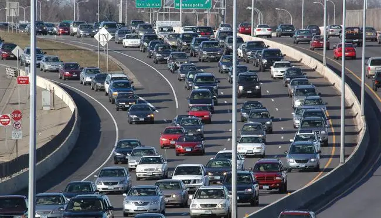
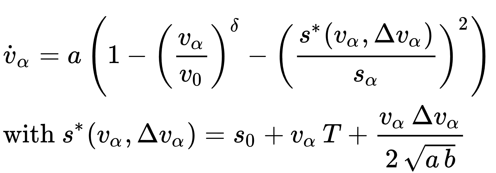
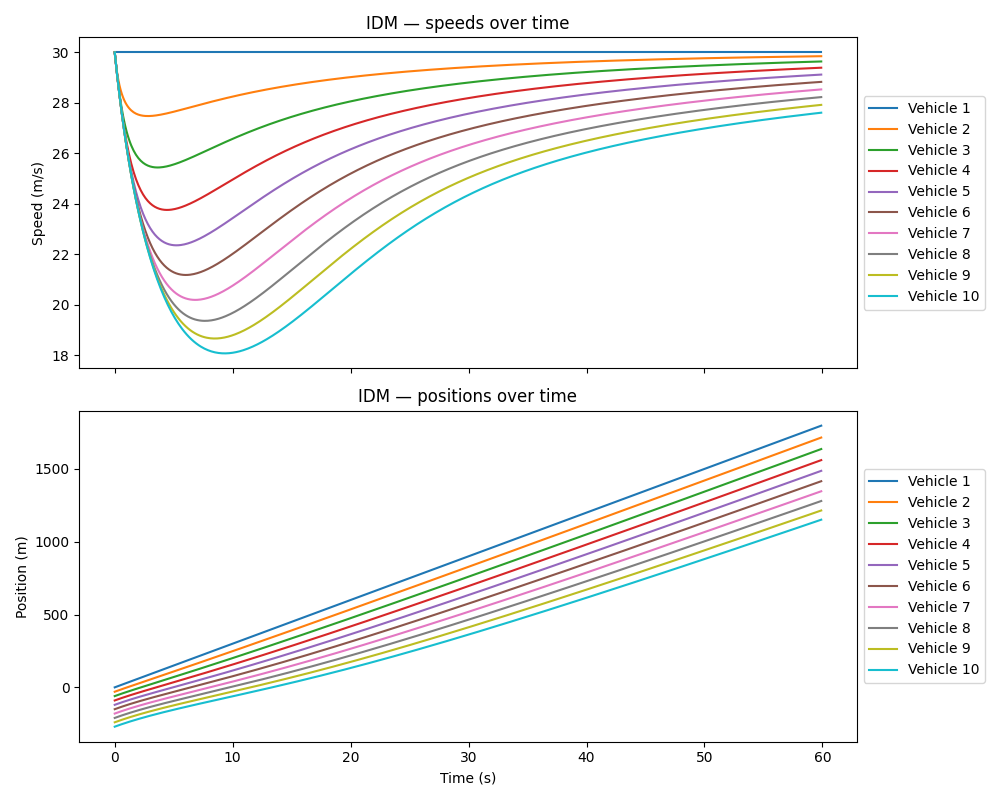
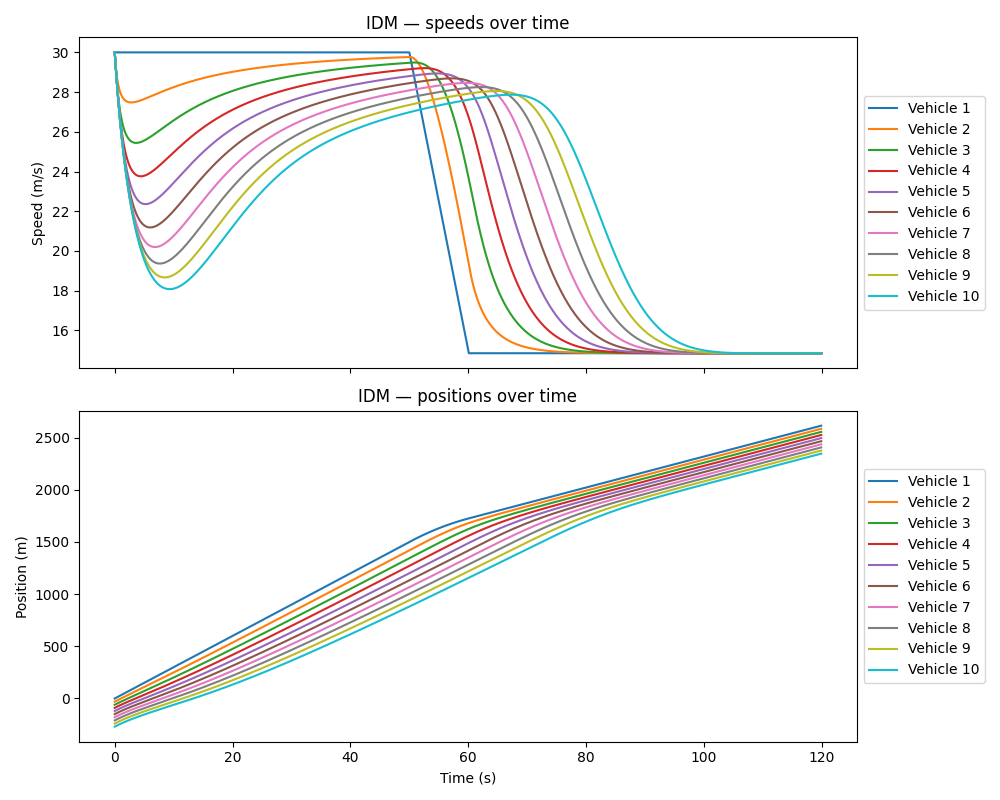

# Intelligent Driver Model (IDM) — Modélisation

This repository was developed in the context of the **Modélisation** course and focuses on the
study, implementation, and analysis of **car-following models**, with emphasis on the
**Intelligent Driver Model (IDM)**.

The objective is to understand how microscopic driving strategies translate into
macroscopic traffic phenomena, such as stability, congestion, and traffic capacity.

  

---

## Intelligent Driver Model

The Intelligent Driver Model (IDM) describes the longitudinal dynamics of a vehicle
based on its own velocity, the distance to the preceding vehicle, and the relative speed.

  

---

## Model Parameters

Where:

- \( v \) is the velocity of the vehicle;
- \( s \) is the bumper-to-bumper distance to the next vehicle;
- \( \Delta v \) is the velocity difference (approaching rate);
- \( v_0 \) is the desired velocity in free traffic;
- \( s_0 \) is the minimum gap at standstill;
- \( T \) is the desired time headway;
- \( a \) is the maximum acceleration;
- \( b \) is the comfortable braking deceleration.

---

## Illustrative Scenarios

The following figures illustrate typical car-following situations and the influence
of relative distance and velocity on the vehicle dynamics.

### Example 1 — Stable Following

  

This configuration corresponds to a stable regime where the desired gap is respected
and the leader's acceleration is constant.

### Example 2 — Breaking

  

In this case, it shows the behavior of the vehicle platoon after the leader brakes.

---

## Implementation

The numerical implementation of the IDM is provided in Python:

- `idm.py`: IDM acceleration function and parameters
- `comp.py`: simulation and comparison utilities
- `MATLAB/`: optional reference implementations

---

## References

- **Lecture 09 — Car-Following Models Based on Driving Strategies**,  
  Technische Universität Dresden.

- Kesting, A., Treiber, M., Helbing, D.  
  *Enhanced intelligent driver model to assess the impact of driving strategies on traffic capacity*.  
  Institute for Transport and Economics, TU Dresden; ETH Zurich.  
  Downloaded from: https://royalsocietypublishing.org/ (19 November 2025)

---

## Context

This repository is part of the coursework for **Modélisation** and is intended for
educational and analytical purposes, linking theoretical models, numerical simulation,
and interpretation of traffic dynamics.
