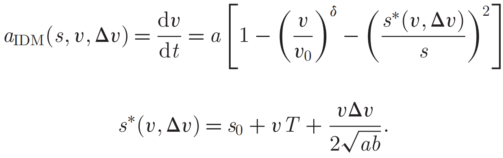
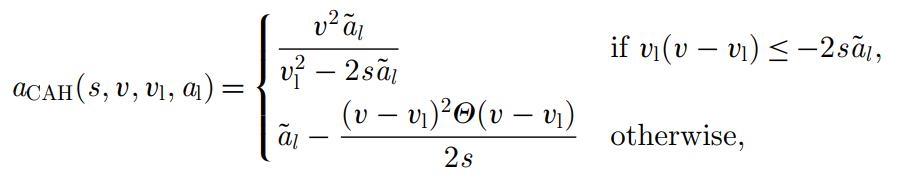
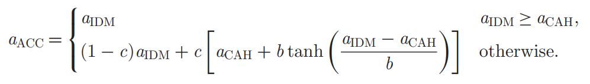
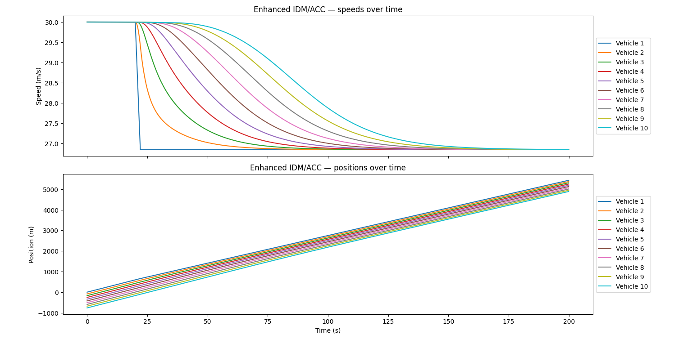

# Enhanced Intelligent Driver Model (Enhanced IDM) — Modélisation

This repository contains implementations and experiments for the **Enhanced Intelligent Driver Model (Enhanced IDM / ACC)**.

The objective is to implement the enhanced IDM variants (IDM blended with ACC heuristics),
allow parameter configuration from Python, and study how driving strategies affect
stability, capacity, and traffic-wave formation.

  

---

## Mathematical Formulation — Enhanced Intelligent Driver Model (ACC)

This section summarizes the mathematical structure of the **Enhanced Intelligent Driver Model (Enhanced IDM / ACC)**  
as proposed by **Kesting, Treiber & Helbing (2010)**.

---

### 1. Intelligent Driver Model (IDM)

The **IDM** defines the longitudinal acceleration of a vehicle as a continuous function
of the traffic state.

#### Acceleration Law & Desired Dynamic Gap

  

#### Interpretation

- The first term represents **free-flow acceleration** toward the desired speed $v_0$.
- The second term enforces **safe car-following** by penalizing small gaps.
- The desired gap $s^*$ combines:
  - minimum standstill distance $s_0$,
  - time-headway control $vT$,
  - dynamic braking based on the relative speed $\Delta v=v-v_l$.

The IDM is **collision-free** but may produce **overly strong braking** in cut-in situations.

---

### 2. Constant Acceleration Heuristic (CAH)

The **CAH** provides an optimistic estimate of a safe acceleration assuming constant
accelerations of both vehicles over a short horizon.

#### CAH Acceleration

  

where

$$
\tilde a_l=\min(a_l,a)
$$

#### Interpretation

- Assumes constant accelerations and zero reaction time.
- Produces **much weaker braking** in mild cut-in scenarios.
- Not a full car-following model (no desired speed or gap control).
- Used only as a **heuristic upper bound** for safe acceleration.

---

### 3. ACC / Enhanced IDM (Blended Model)

The **ACC model** smoothly combines the IDM and CAH accelerations to obtain
realistic yet safe driving behavior.

#### ACC Acceleration Law

  

#### Interpretation

- The acceleration is **never lower than IDM**, preserving safety.
- In mildly critical situations, braking is **relaxed toward CAH**.
- In strongly critical situations, the response remains conservative.
- The hyperbolic tangent ensures **smoothness and differentiability**.

The parameter $c\in[0,1]$ is the **coolness factor**:
- $c=0$: pure IDM,
- $c\approx1$: highly relaxed ACC behavior.

---

### Model Parameters

| Symbol | Meaning |
|------|--------|
| $v$ | Vehicle velocity |
| $v_l$ | Leader velocity |
| $\Delta v=v-v_l$ | Approaching rate |
| $s$ | Net gap (bumper-to-bumper distance) |
| $v_0$ | Desired speed |
| $T$ | Desired time headway |
| $s_0$ | Minimum gap |
| $a$ | Maximum acceleration |
| $b$ | Comfortable deceleration |
| $a_l$ | Leader acceleration |
| $c$ | ACC coolness factor |
| $\delta$ | Free-flow acceleration exponent |

---

**Key idea**  
The Enhanced IDM preserves the theoretical safety and stability of the IDM while
eliminating unrealistic braking reactions in lane-change and cut-in scenarios.

---

## Illustrative Scenario

The following figure illustrates a typical car-following situation and the influence
of relative distance and velocity on the vehicle dynamics.

### Example — Braking

  

This case shows the behavior of a vehicle platoon after the leader brakes.

---

## Implementation

Python implementations included in this workspace:

- **idm.py** — baseline IDM model and a simple simulator  
- **enhenced_idm.py** — Python port of the enhanced IDM / ACC (CAH + blending)  
- **config.py** — configuration for the baseline IDM  
- **config_enhenced_idm.py** — configuration for the enhanced-IDM experiments  
- **Enhenced IDM – MATLAB/** — original MATLAB reference implementations

---

## References

- **Lecture 09 — Car-Following Models Based on Driving Strategies**, Technische Universität Dresden.  
- Kesting, A., Treiber, M., Helbing, D.  
  *Enhanced intelligent driver model to assess the impact of driving strategies on traffic capacity*.  
  Institute for Transport and Economics, TU Dresden; ETH Zurich.  
  Downloaded from: https://royalsocietypublishing.org/ (19 November 2025)

---

## Context

This repository is part of the coursework for **Modélisation** and is intended for
educational and analytical purposes, linking theoretical models, numerical simulation,
and interpretation of traffic dynamics.
